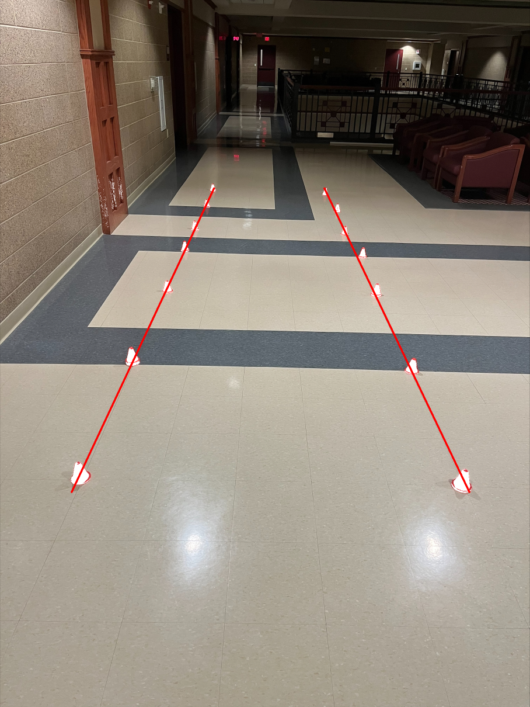

# Perception Challenge

## answer.png
Below is the output image with boundary lines drawn, saved as `answer.png`:

## Methodology
1. **Load Image:** Use OpenCV to load the input image.
2. **Color Detection:** Identify pixels that match the color range of the red cones.
3. **Coordinate Extraction:** Extract coordinates of the identified red pixels.
4. **Density Calculation:** Compute the density of x and y coordinates to group the detected cones.(Unneccesary)
5. **Boundary Lines:** Draw boundary lines based on the grouped cone coordinates.
7. **Display Image:** Show the annotated image.

### What did you try and why do you think it did not work?
- **Attempt 1:** Linearizing from two points. This method was not accurate due to the variability in cone placement and potential noise in the image.
- **Attempt 2, Part 1:** Using density and mean to find all cones. This approach was too complex and unnecessary for the task at hand.
- **Attempt 2, Part 2:** Realized it was sufficient to identify the last line of densities on the left and right sides to determine the boundary lines, making the process more efficient and accurate.

## What libraries are used
- **OpenCV:** For image processing and computer vision tasks.
- **NumPy:** For array operations and numerical computations.
